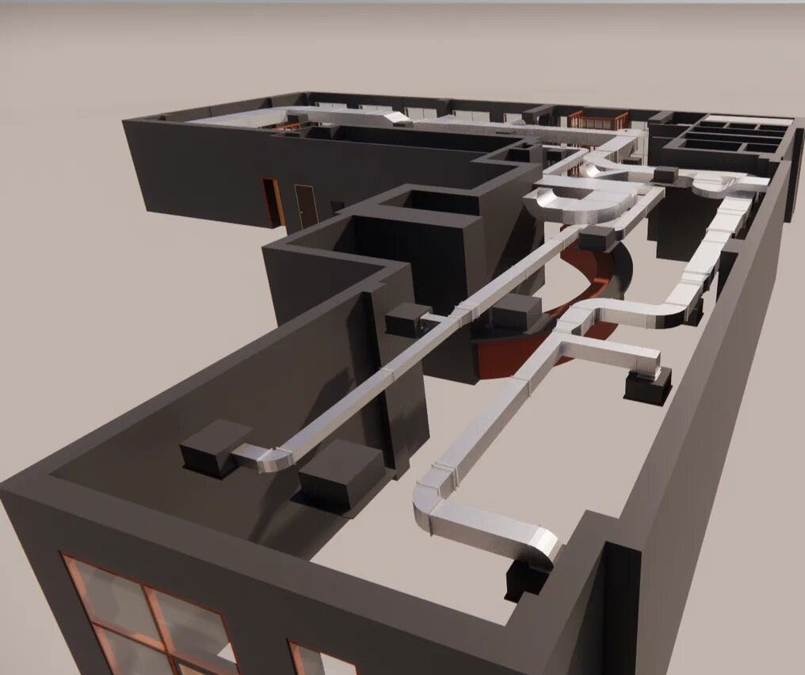
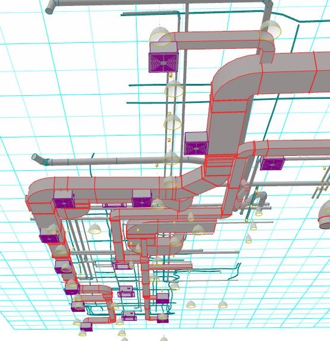
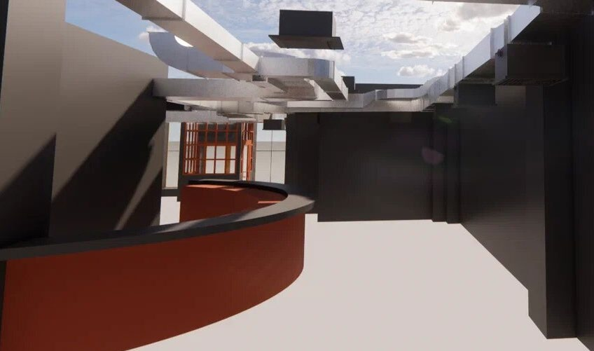
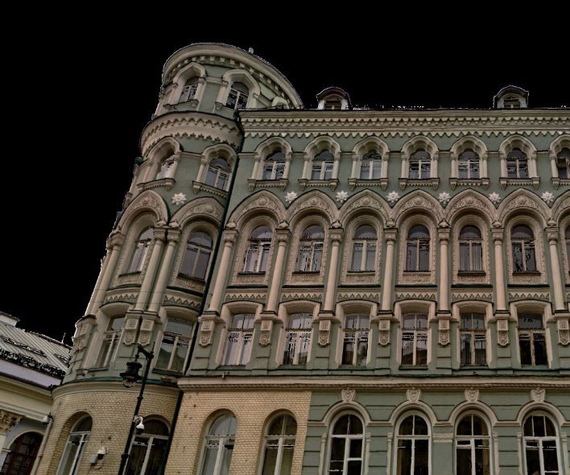
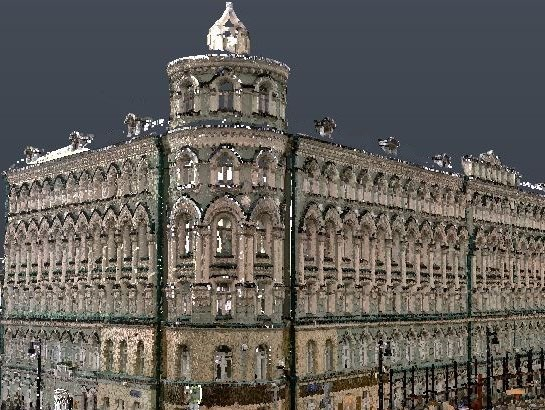
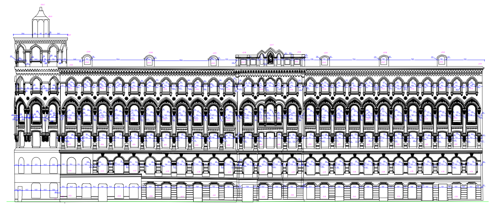
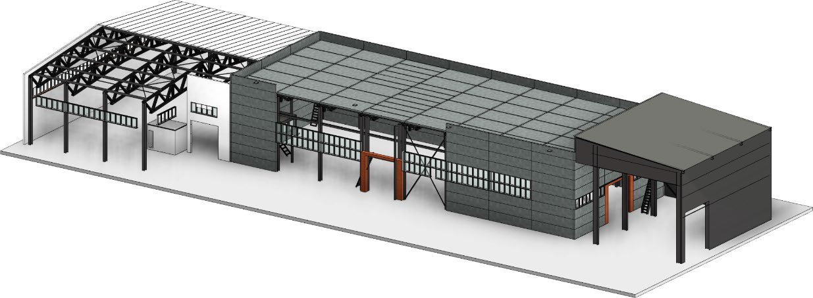
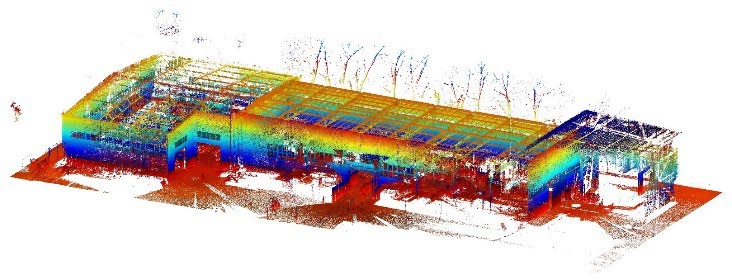
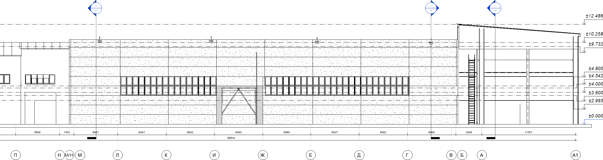

# Три реальных проекта для портфолио 3D-Scan NN

Подготовлено 27.09.2026 по поручению владельца. Это локальный черновик текстов и подбор изображений для просмотра; на сайт материалы ещё не добавлены. Владелец подтвердил, что проекты из предоставленной презентации выполнены его командой.

Рекомендуемый порядок: кафе, фасад на Ильинке, Щербинский лифтостроительный завод. Первый кейс ближе к существующей странице обмеров помещений; два следующих показывают работу со сложными фасадами и промышленными зданиями.

Для главной подготовлены короткие карточки. Подробный текст кафе можно использовать на существующей странице помещений после согласования размещения. Остальные подробные тексты сохраняются как готовая основа; новые страницы услуг этим документом не назначаются.

## 1. Кафе — обмеры для нового интерьера

### Короткая карточка

**Обмеры кафе для нового интерьера и инженерных сетей**

Москва · 14 дней · Модель Revit

Выполнили лазерное сканирование действующего кафе и подготовили модель помещения с инженерными сетями. Результат — фактическая геометрия для разработки нового интерьера и проектирования коммуникаций.

Кнопка: **Обсудить похожую задачу**.

### Подробный текст

Заказчику требовалась фактическая геометрия существующего кафе для нового дизайн-проекта и проектирования инженерных сетей. Для этой задачи выполнили лазерное сканирование и подготовили трёхмерную модель помещения в Revit.

В модели показаны планировка, конструкции и инженерные коммуникации. Её пространственные виды позволяют рассмотреть взаимное расположение элементов и использовать полученные данные при дальнейшей разработке проектных решений.

**Результат:** модель существующего помещения с инженерными сетями в формате RVT. **Срок выполнения проекта:** 14 дней.

Похожая задача? Расскажите об объекте и необходимых материалах — обсудим состав обмеров и подготовки модели.

### Выбранные изображения

**Основное изображение.** Вид модели кафе сверху: планировка, перегородки и коммуникации.

**Деталь.** Инженерные сети в модели существующего помещения.

**Вид изнутри.** Изображение модели кафе, не фотография помещения.

**Редакторская сверка:** презентация, страницы 63–64. Площадь, дата выполнения и стоимость этого заказа не указаны и в текст не добавлены. Работа на действующем объекте не доказывает, что кафе продолжало обслуживать посетителей во время сканирования; такого обещания нет. Формулировки о расчёте сметы и VR в источнике описывают варианты применения, поэтому не представлены как уже достигнутый результат заказчика.

## 2. Фасад на Ильинке — материалы для реставрации

### Короткая карточка

**Фасад на Ильинке: чертежи для реставрационных работ**

Москва · Площадь здания 4 500 м² · 7 дней

Отсканировали фасад здания с элементами лепнины и подготовили исполнительные чертежи. В результате получены цветное облако точек и подробная геометрия фасада для подготовки реставрационных работ.

Кнопка: **Обсудить обмеры фасада**.

### Подробный текст

Для подготовки реставрационных работ на здании на улице Ильинка требовались исполнительные чертежи фасадов с элементами лепнины. При таком составе работ важно передать не только общий контур здания, но и геометрию архитектурных деталей.

Выполнили лазерное сканирование и подготовили цветное облако точек сооружения и исполнительные чертежи фасадов. На чертежах отображены оконные проёмы, декоративные элементы и размеры.

**Результат:** облако точек и комплект исполнительных чертежей фасадов для дальнейшей работы над реставрацией. **Площадь здания:** 4 500 м². **Срок выполнения проекта:** 7 дней.

Планируете реставрацию или ремонт фасада? Обсудим требуемую детализацию обмеров и состав чертежей.

### Выбранные изображения

**Основное изображение.** Фотография фасада здания на улице Ильинка.

**Данные сканирования.** Цветное облако точек фасада по результатам сканирования.

**Результат.** Исполнительный чертёж фасада с архитектурными деталями.

**Редакторская сверка:** презентация, страницы 30–31. Число 4 500 м² обозначено в источнике как площадь здания; это не площадь отсканированного фасада. Формальный статус ОКН для этого здания в данных двух страницах не указан и не заявляется. Фотография, облако точек и чертёж относятся к одному проекту; это разные виды материалов, а не фотографии до и после ремонта. Стоимость, дата выполнения и измеренная экономия не добавлены.

## 3. Щербинский лифтостроительный завод — модель для реконструкции

### Короткая карточка

**BIM-модель завода для проектирования реконструкции**

Щербинский лифтостроительный завод · Москва · 78 000 м² · 4 месяца

Подготовили фактическую BIM-модель завода с классификацией и атрибутами элементов. Модель существующего объекта предназначена для разработки решений по реконструкции и последующей эксплуатации.

Кнопка: **Обсудить промышленный объект**.

### Подробный текст

Для проектирования реконструкции Щербинского лифтостроительного завода требовалась модель, отражающая фактическую геометрию существующего объекта. Площадь здания, указанная в материалах проекта, — 78 000 м².

Подготовили BIM-модель с классификацией и атрибутами элементов. В материалах проекта представлены облако точек, модель производственных конструкций и разрез здания с размерами и высотными отметками.

**Результат:** фактическая BIM-модель для работы над проектом реконструкции. В исходном портфолио также предусмотрено её применение при эксплуатации после ввода обновлённого завода. **Срок выполнения проекта:** 4 месяца.

Готовите реконструкцию промышленного объекта? Обсудим задачи проектировщиков и необходимый состав модели.

### Выбранные изображения

**Основное изображение.** BIM-модель производственного здания с отображением конструкций.

**Данные сканирования.** Облако точек производственного здания. Цветовая схема — способ отображения данных.

**Деталь результата.** Разрез производственного здания с размерами и высотными отметками.

**Редакторская сверка:** презентация, страницы 37–38. Площадь относится к зданию по подписи источника. Не добавлены конкретный формат файла, LOD, состав инженерных сетей, точность, цена и дата проекта. Цвета облака не названы картой дефектов или отклонений. Факт состоявшейся реконструкции и достигнутая экономия не подтверждаются этими материалами и не заявляются.

## Принцип подачи и качество изображений

В каждом кейсе сначала показываем задачу заказчика и результат, затем технические детали. Для будущей главной достаточно основной иллюстрации, короткого текста и фактов. Дополнительные изображения пригодны для подробного представления кейса; способ открытия и размещение согласуются при работе над сайтом.

Изображения извлечены из самих документов, без снимков целых слайдов. Содержимое не ретушировалось, не генерировалось и не увеличивалось. Изображения JPEG 2000 переведены в PNG с сохранением декодированных пикселей и прозрачности; остальные скопированы без изменения извлечённых байтов.

Фотография Ильинки имеет размер 708 × 590, её облако точек — 545 × 410; облако завода — 732 × 280. Они подходят для небольших иллюстраций, но их не стоит растягивать на весь экран. Чертежи шириной 1 790 и 2 330 пикселей лучше показывать крупнее, чтобы были различимы детали. Изображения с прозрачностью размещать на светлой подложке. В Word-версии найден более крупный вид модели кафе, однако на нём видна кнопка интерфейса Revit; в подборку выбран вид того же объекта из презентации без этой кнопки.

Подписи, альтернативные описания, размеры, происхождение и контрольные суммы всех девяти файлов находятся в [sources.json](2026-09-27-real-project-cases/sources.json). Веса исходных иллюстраций — около 2,60 МБ суммарно; подготовка облегчённых вариантов для сайта остаётся частью будущей реализации.

## Источники и границы публикации

Основной источник — предоставленный владельцем файл «Презентация проектов 3dProscan (Подробная) М.pdf», страницы 30–31, 37–38, 63–64. Номера — страницы PDF, совпадающие с номерами на просмотренных слайдах. Изображения каждого кейса выбраны только из соответствующих ему страниц.

Файл «Примеры работ_2.docx» использован для сравнения качества изображения кафе. Коммерческие предложения изучены на предыдущем этапе; предварительные площади, цены, графики оплаты и сроки из них в эти три кейса не перенесены. Оригинальные документы, сведения о штатной численности, контакты филиалов и общие рекламные обещания презентации в подборку не копируются.

Владелец подтвердил выполнение проектов своей командой. Точные даты проектов, отзывы, экономический эффект и дополнительные гарантии не установлены. Сроки здесь описывают конкретные выполненные проекты; они не являются обещанием аналогичного срока для нового заказа. Состав кейсов, включая BIM-моделирование и инженерные сети, не объявляется включённым в базовую цену обмеров.

**Следующий шаг:** просмотр владельцем текстов и выбранных изображений, затем отдельное поручение на размещение. Согласование публикации названий и иллюстраций входит в решение о размещении; текущий локальный черновик не является публикацией.
